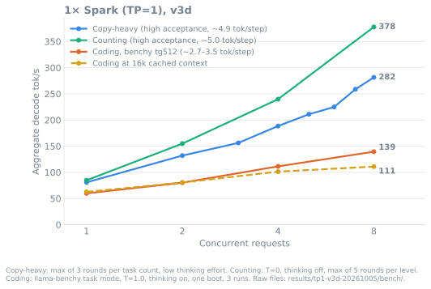
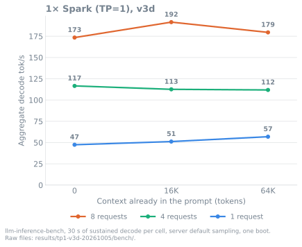
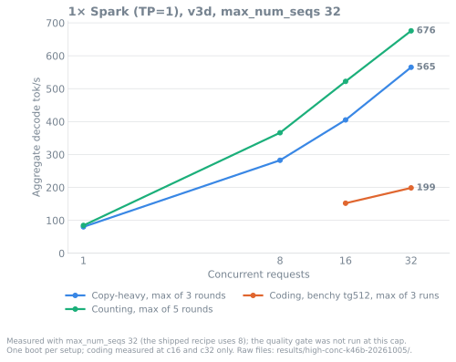
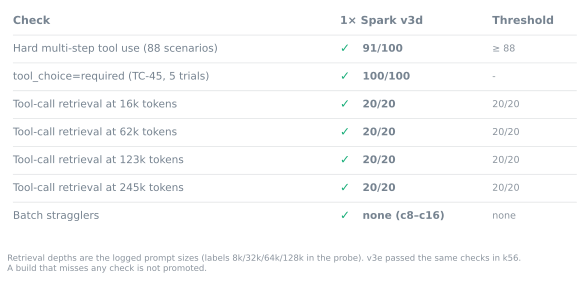
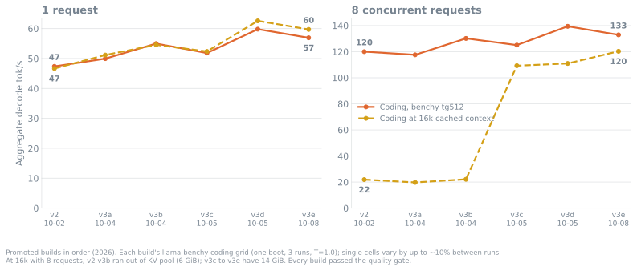

<div align="center">

# Qwen3.8-Flash-Next on one DGX Spark

NVFP4 Qwen3.8-Flash-Next on vLLM V2 with b12x kernels and 4-token MTP, on a single GB10 (TP=1), launched with sparkrun.
262k context, OpenAI-compatible API. Experimental: NVFP4 GDN weights for decode, the PLE table read through the page
cache, and a retrained MTP drafter.<br>
A build is promoted only if it passes the [quality gate](#quality-gate) and no c1–c4 cell is slower beyond noise.



</div>

| Workload | Tokens / step | 1 request | 4 requests | 8 requests |
|---|:---:|:---:|:---:|:---:|
| **Copy-heavy** (high acceptance, max of 3 rounds) | 4.90–4.96 | 81 | 189 | **282** |
| **Counting** (high acceptance, max of 5 rounds) | 4.82–5.00 | 85 | 240 | **378** |
| **Coding**, llama-benchy tg512 | 3.3–3.5 | 60 | 111 | 139 |
| **Coding** at 16k cached context | 3.1–3.4 | 63 | 101 | 111 |
| **Prefill**, 2,048-token prompt | | 1,788 | | |
| **Prefill**, filling a 16k context | | 2,088 | | |

Aggregate decode tok/s unless marked prefill. Build v3d (2026-10-05). The current build, v3e (2026-10-08), is v3d
with a retrained MTP drafter; its paired screen against v3d is under [Measured](#measured).

<div align="center">

[](#quality-gate)
[](#quality-gate)
[](#quality-gate)
[](#quality-gate)
<br>
[](#changelog)
[](#how-it-works)
[](LICENSE)

</div>

## Quick start

Needs [sparkrun](https://github.com/eugr/sparkrun) ≥ 0.3.6.

```sh
sparkrun registry add https://github.com/ursuciprian/qwen3.8-flash-next-1x-dgx-spark
sparkrun run qwen3.8-flash-next-1x-dgx-spark --hosts <spark> --solo
```

Then [verify](#verify) the server. Base URL `http://<spark>:8000/v1`, model `qwen3.8-flash-next`.

The recipe serves its own checkpoint, about 98 GB. A fresh download took about 3 h 15 min on my link (~8.6 MB/s).
Download it on the Spark before the first boot, together with the two files of the base checkpoint that the recipe
uses for prefill (2.6 GiB):

```sh
hf download ursuciprian/Qwen3.8-Flash-Next-NVFP4-GDN-MSE --revision 16c9bd54788d12390838a65ce4a4ecda97fa5f1d
hf download local-inference-lab/Qwen3.8-Flash-Next-NVFP4 --revision 7c4f1bc1a2d6847e0cbc01ac6b823f00251de8dd \
  model-00035-of-00036.safetensors model.safetensors.index.json
```

> Moved here on 2026-10-08 from [qwen3.8-flash-next-dgx-spark-tp-2](https://github.com/ursuciprian/qwen3.8-flash-next-dgx-spark-tp-2),
> which now covers the two-Spark (TP=2) recipe and keeps a copy of this recipe so existing `sparkrun run` setups keep
> working. If both registries are added, sparkrun finds the recipe name twice; pick this one with
> `sparkrun run @qwen38-flashnext-1x/qwen3.8-flash-next-1x-dgx-spark --hosts <spark> --solo`.

Two Sparks can run one copy of this recipe each behind a router (DP=2). How-to and measurements:
[DP=2 in the tp-2 repo](https://github.com/ursuciprian/qwen3.8-flash-next-dgx-spark-tp-2#two-sparks-one-cluster-or-one-copy-per-spark).

[Measured](#measured) · [Quality gate](#quality-gate) · [Verify](#verify) · [Requirements](#requirements) · [Known limits](#known-limits) · [Recipes](#recipes) · [Changelog](#changelog) · [How I measure](#how-i-measure) · [Troubleshooting](#troubleshooting)

## Measured

Workloads are labelled per row, because they differ by about 1.5× in tokens per decode step:

- High-acceptance workloads (copying, counting) accept nearly every MTP draft (~4.9–5.0 tokens per step). They show
  the decode rate when drafts land, which bounds what MTP can give.
- Coding (llama-benchy) is an agent coding turn at temperature 1.0 with thinking on (3.1–3.5 tokens per step), the
  rate an agent sees.
- Coding (36 prompts) sends 36 short coding requests (12 Python, 8 each C++, Rust and Go) one at a time, up to 768
  tokens out, once at temperature 0 with thinking off and once with the server defaults (thinking on). The cell is
  the median decode tok/s of the 36 requests, with the max in brackets
  ([details](docs/BENCHMARKS.md#coding-probe-36-prompts-in-four-languages-2026-10-06)).

### Build v3e

v3e is v3d with a retrained MTP drafter, published as revision
[`16c9bd54`](https://huggingface.co/ursuciprian/Qwen3.8-Flash-Next-NVFP4-GDN-MSE/tree/16c9bd54788d12390838a65ce4a4ecda97fa5f1d)
of the same checkpoint. Only the drafter's 24 dense BF16 tensors changed. I trained them for 72 steps (0.66 epoch) on
about 3.5M tokens of v3d's own outputs, with a KL loss to the served target's top-20 distribution at 6 draft depths,
in the served fp8 drafter KV format ([#97](https://github.com/ursuciprian/qwen3.8-flash-next-dgx-spark-tp-2/issues/97)).
The training code is in [`tools/mtp_refit/`](tools/mtp_refit/).

Screen against v3d (k56, Thunderdome, one arm per Spark, control and arm booted alternately, 2 passes, T=0). Change
in tok/s, noise band in brackets; no cell was worse beyond its noise band:

| Cell | dgx-01 | dgx-02 |
|---|:---:|:---:|
| Acceptance per draft position 1 / 2 / 3 / 4, v3d → v3e | 0.819 / 0.661 / 0.535 / 0.431 → 0.856 / 0.713 / 0.593 / 0.489 | 0.818 / 0.666 / 0.539 / 0.438 → 0.854 / 0.708 / 0.589 / 0.488 |
| Fresh, 1 request | +5.7% (4.7%) | +2.8% (8.5%) |
| Fresh, 4 requests | +4.9% (3.1%) | +7.9% (2.8%) |
| Fresh, 8 requests | +6.8% (3.6%) | +8.1% (2.6%) |
| 16K context, 4 requests | +5.5% (3.7%) | +5.7% (3.2%) |
| Counting, 8 requests | +1.2% (1.0%) | −0.1% (2.8%) |
| 16K context, 8 requests, wall time | +2.9% (1.0%) | +2.0% (1.0%) |
| llama-benchy pp2048, 1 request | +0.0% (1.0%) | −0.9% (2.0%) |
| llama-benchy tg512, 1 request | +4.3% (7.6%) | +1.6% (10.3%) |
| llama-benchy tg512, 8 requests | +3.7% (4.9%) | +1.2% (3.6%) |

Offline, on the held-out 5% of the data, acceptance per position at T=0 went from 0.878 / 0.750 / 0.635 / 0.534 /
0.449 / 0.377 to 0.905 / 0.797 / 0.699 / 0.614 / 0.542 / 0.480 (positions 1 to 6), and every prompt category improved.
The gate passed on both Sparks (see [Quality gate](#quality-gate)). Raw files:
[`results/thunderdome-k56-20261007/`](results/thunderdome-k56-20261007/), Jev ship verdict 0.97 in
[`jev-ship.json`](results/thunderdome-k56-20261007/jev-ship.json).

### Build v3d, full benchmark run

The table below is v3d's full benchmark run (2026-10-05); v3e has not been re-run on that set.

| Workload | Tokens/step | c1 | c4 | c8 | Build |
|---|:---:|:---:|:---:|:---:|---|
| **High-acceptance:** copy-heavy, max of 3 rounds | 4.90–4.96 | 80.8 | 188.5 | 281.5 | v3d (2026-10-05) |
| **High-acceptance:** counting, T=0, max of 5 rounds | 4.82–5.00 | 84.8 | 239.8 | 377.8 | v3d (2026-10-05) |
| **Coding:** llama-benchy tg512, depth 0 | 3.3–3.5 | 59.8 | 111.4 | 139.5 | v3d (2026-10-05) |
| **Coding:** llama-benchy tg512, 16k cached depth | 3.1–3.4 | 62.6 | 101.4 | 111.0 | v3d (2026-10-05) |
| **Coding:** 36 prompts, T=0, thinking off, median (max) | 3.96 | 72.9 (81.8) | | | v3d (2026-10-06) |
| **Coding:** 36 prompts, server defaults (thinking on), median (max) | 3.38 | 59.7 (67.2) | | | v3d (2026-10-06) |

v3d and v3e serve [`ursuciprian/Qwen3.8-Flash-Next-NVFP4-GDN-MSE`](https://huggingface.co/ursuciprian/Qwen3.8-Flash-Next-NVFP4-GDN-MSE):

- This is the NVFP4 checkpoint with its 36 GDN layers' projection weights requantized to weight-only NVFP4. Every other
  tensor is unchanged.
- Decode steps (at most 40 rows) read the NVFP4 weights, about half the bytes of MXFP8.
- Calls of 41 or more rows (prefill) use an MXFP8 copy of the same weights, taken from the base checkpoint.

In the paired screen against v3c (same Spark, T=0), counting c8 was +7.8%, 16K c4 +5.9%, fresh c8 +4.4% and tg512 c1
50.0 → 59.7 tok/s. pp2048 c1 was −0.9% (noise 1.0%), and every other cell was within noise
([report](results/tp1-v3d-20261005/screen-v3d-c41-vs-v3c.txt)). Single cells of the coding grid vary by up to ~10%
between runs.

Prefill (c1): 1,788 tok/s for a 2,048-token prompt; 2,088 tok/s filling a 16k context. TTFT at c1: 1.18 s (2k new
tokens) / 1.94 s (2k new tokens on a 16k cached context).

KV pool: 14 GiB, 993,754 tokens, which vLLM reports as 3.79x concurrency at 262,144 tokens per request.

| Context length | Requests that fit in the KV pool at once, v3b (6 GiB) | v3c / v3d / v3e (14 GiB) |
|---|:---:|:---:|
| 16K + 512 out | 7.4 | 39.7 |
| 64K + 512 out | 4.2 | 14.1 |
| 128K + 512 out | 2.6 | 7.5 |

Per 3,024 tokens of context a request takes one KV page in each of 13 attention groups, plus 37 GDN state pages
(185 before compact records); method and serve-log token counts: [`kv-capacity.txt`](results/tp1-v3c-20261005/kv-capacity.txt).
`max_num_seqs` is 8, so 8 requests at 16K and 64K run without waiting.

### Decode at 0 / 16K / 64K context (llm-inference-bench)

30 s of sustained decode per cell at c1/c4/c8, with 0, 16K or 64K tokens already in each prompt, server default
sampling, thinking on; one boot per build (2026-10-05). Aggregate tok/s:

| Build | c1 (0 / 16K / 64K) | c4 (0 / 16K / 64K) | c8 (0 / 16K / 64K) | Tokens/step |
|---|:---:|:---:|:---:|:---:|
| v3d | 47.4 / 51.2 / 56.9 | 116.6 / 112.6 / 111.8 | 173.4 / 191.5 / 179.5 | 2.6–3.5 |
| v3c | 43.7 / 43.0 / 43.3 | 106.2 / 116.9 / 113.9 | 165.7 / 165.6 / 160.4 | 2.7–3.3 |
| v3b (6 GiB pool) | 46.9 / 45.3 / 44.3 | 116.5 / 112.0 / 106.3 | 168.4 / 174.8 / did not fit | 2.8–3.3 |



Same runs, other checks:

- Standalone prefill of an 8K prompt: 2,137 tok/s on v3d. v3d gave 2,182 / 2,147 / 2,066 / 1,880 at 16K / 32K / 64K /
  128K, 0.9–1.2% below v3c.
- Hotel-lights reasoning check (8 concurrent runs per batch, v3c). At the recipe default `reasoning_effort: medium`
  it answered 21/32 correctly. With `xhigh` sent per request it answered 31/31 completed runs, at a median of 39.6K
  reasoning tokens ([#88](https://github.com/ursuciprian/qwen3.8-flash-next-dgx-spark-tp-2/issues/88)). The default
  stays `medium` because `xhigh` led to runaway thinking on validator-gated tasks (see [Thinking effort](#thinking-effort)).
  - For hard reasoning problems, send `"reasoning_effort": "xhigh"` per request with a long client timeout: most `xhigh`
    answers took over 30 minutes at 8 concurrent requests.
  - At `medium`, v3b gave 23/32 in the same comparison (Fisher exact p = 0.79 vs v3c,
    [#87](https://github.com/ursuciprian/qwen3.8-flash-next-dgx-spark-tp-2/issues/87)). The misses are mostly 49 or 47
    instead of 48. Every run ended on its own stop token. Raw runs:
    [`results/hotel-ab-20261005/runs.jsonl`](results/hotel-ab-20261005/runs.jsonl).
  - The 8-run check in the v3d benchmark run (default effort) gave 6/8.
- The v3b 64K c8 cell was skipped because 8 × 64K did not fit its 379,362-token pool.

Raw files: [`results/lib-bench-20261005/`](results/lib-bench-20261005/) (v3b),
[`results/tp1-v3c-20261005/bench/`](results/tp1-v3c-20261005/bench/) (v3c) and
[`results/tp1-v3d-20261005/bench/`](results/tp1-v3d-20261005/bench/) (v3d).

Conditions. Coding rows: [llama-benchy](https://github.com/ursuciprian/llama-benchy) `--prompt-mode task`, 2,048 new
prompt tokens, up to 512 out, thinking on, T=1.0 / top-p 0.95 / top-k 20, prefix caching on; one boot × 3 runs.
Counting: "list the numbers from 1 to 300", T=0, thinking off, 5 rounds per concurrency level with every round saved;
the tables show the max round (median of 5 rounds: 83.0 / 235.3 / 368.3 at c1/c4/c8). Copy-heavy benchmark: 1–8
concurrent copy tasks from a shared cached prefix at low reasoning effort, 1,500 tokens out, 3 rounds per task count;
tok/s is counted over the window where all tasks decode, and the tables show the max of the 3 rounds (v3c rerun in the
same window on the other Spark: 74.8 / 189.6 / 268.4 at 1/4/8 tasks). Tokens/step is 1 + 4 × accepted/draft tokens
from vLLM's spec-decode counters. Raw files: [`results/tp1-v3d-20261005/bench/`](results/tp1-v3d-20261005/bench/).
Charts: `uv run scripts/make_charts.py` renders every chart on this page from those files.

### High concurrency: measured with max_num_seqs 32, quality gate not run at this cap

The shipped recipe caps concurrency at 8 requests. This run raised `max_num_seqs` to 32 to show how far aggregate
throughput goes. The quality gate has not been run at this cap, so these are throughput measurements only, not a
supported configuration. One fresh boot of v3d (2026-10-05).



| Workload | c16 | c32 |
|---|:---:|:---:|
| Counting, max of 5 rounds | 522.2 | **675.9** |
| Copy-heavy, max of 3 rounds (streams) | 405.2 | **565.2** |
| Coding, llama-benchy tg512, max of 3 runs | 152.1 | **198.7** |

- Straggler probe at c8/c16/c32: 0 preemptions, 3.98–3.99 accepted per 4 drafts.
- Per-request speed drops as requests are added. At c32 counting runs at 21.6 tok/s per request, and the TTFT probe
  (~1.5K-token prompts) reached 22.2 s at p50.
- Lowest MemAvailable 4.5 GiB, under the 6 GiB headroom the shipped recipe keeps. A boot at `max_num_seqs` 16 was
  stopped by the 4 GiB memory guard during startup.

Full tables: [docs/BENCHMARKS.md](docs/BENCHMARKS.md#high-concurrency-max_num_seqs-32-2026-10-05), raw files:
[`results/high-conc-k46b-20261005/`](results/high-conc-k46b-20261005/).

## Quality gate

A build ships only if it passes every check.



| Check | Tool | v3d | v3e (k56, both Sparks) |
|---|---|:---:|:---:|
| Hard multi-step tool use (88 scenarios, thinking on, T=0); gate ≥ 88 | [tool-eval-bench](https://github.com/SeraphimSerapis) `--hardmode` | 91/100 (v3c 93) | 91/100 |
| `tool_choice=required` compliance, 5 trials | TC-45 | 100/100 | 100/100 |
| Long-context tool-call retrieval, 20 needles per depth; actual prompt sizes ~15.7k / 61.7k / 122.6k / 245k tokens | [`scripts/fidelity_probe.py`](scripts/fidelity_probe.py) | 20/20 at every depth; ~245k seeds 11, 13: 20/20 | 20/20 at every depth; one of the three ~245k seeds on dgx-01 19/20 (119/120 overall) |
| Batch stragglers | [`scripts/straggler_probe.py`](scripts/straggler_probe.py) | none, c8–c16, 0 preemptions (3.98–3.99 accepted per 4 drafts) | none, c8–c16, 0 preemptions |
| Numerics vs previous build (20 prompts × 16 tokens, top-5 logprobs) | [`scripts/logits_equiv.py`](scripts/logits_equiv.py) | vs v3c: 0.034–0.048 vs self-noise 0.033–0.042 (weights differ, so no output identity check) | target weights unchanged; drafter only proposes tokens |
| MTP acceptance per draft position (numerics canary) | paired decode probe | within 0.005 of v3c at every position (0.816 / 0.667 / 0.540 / 0.440) | +0.036 to +0.058 per position, the intended effect of the new drafter |
| Host memory headroom during the gate | `MemAvailable` | min 14.04 GiB (13.30 GiB during the benchmark run) | min 13.92 GiB |
| DevOps task set (14 prompts × 3, graded by terraform / kubeconform / actionlint / shellcheck / helm / hadolint / promtool) | own grader | 97.8% checks, 35/42 clean, 0/42 runaway (b1.4 weights at TP=1; not rerun on v3d) | not rerun |

Images also pass a seed check before they ship: a first boot must log 0 measured b12x plans
([`scripts/check_seed.py`](scripts/check_seed.py)), because a seed that lacks plans makes a fresh install tune them on
its own and serve other kernels than the ones measured.

Depth labels in the gate logs are 8k / 32k / 64k / 128k; the probe sizes transcripts by characters, and the logged
actual prompt sizes are the token counts in the table above.

Not yet measured at the `medium` thinking default: MMLU-Pro, GSM8K, IFEval, LiveCodeBench.

## Verify

`sparkrun run` returns before the engine is ready. Wait for health, then check that the reply has both reasoning and
an answer:

```sh
H=http://<spark>:8000
until [ "$(curl -s -o /dev/null -w '%{http_code}' $H/health)" = 200 ]; do sleep 10; done
curl -s $H/v1/chat/completions -H 'Content-Type: application/json' -d '{
  "model":"qwen3.8-flash-next","max_tokens":1024,
  "messages":[{"role":"user","content":"Write a Python function that reverses a string."}]}' \
| python3 -c "import json,sys; m=json.load(sys.stdin)['choices'][0]['message']
print('reasoning:', len(m.get('reasoning') or m.get('reasoning_content') or ''), 'chars')
print('content  :', (m.get('content') or '')[:300])"
```

Empty `content` with long reasoning means `max_tokens` ran out inside thinking; garbled text means a checkpoint
mismatch (see [Troubleshooting](#troubleshooting)).

Optional long-context check (stdlib Python), expect `exact 20` at both depths.

```sh
git clone https://github.com/ursuciprian/qwen3.8-flash-next-1x-dgx-spark && cd qwen3.8-flash-next-1x-dgx-spark
python3 scripts/fidelity_probe.py --base $H --model qwen3.8-flash-next --depths 8000,32000
```

The server binds 0.0.0.0 with no API key: keep it on a trusted network or put a proxy with auth in front.
Stop with `sparkrun stop --all`.

> To upgrade, note that sparkrun caches registries and does not refresh them on `run`. Run `sparkrun registry update qwen38-flashnext-1x`
> first, or the previous recipe revision boots.

## Requirements

| | |
|---|---|
| **Hardware** | 1× DGX Spark (GB10, 128 GB unified); checkpoint on local NVMe (the PLE table is read through the page cache) |
| **Launcher** | sparkrun ≥ 0.3.6 |
| **Disk** | ~128 GB (97.7 GiB checkpoint + 2.6 GiB MXFP8 shard + image) |
| **Kernel** | No NCCL at TP=1, so the `7.0.0-1019-nvidia` NCCL regression of the 2× recipe does not apply |
| **Boot** | ~3 min (171 s) with the compile cache from the image and a warm page cache, once the checkpoint is downloaded |
| **Concurrency** | `max_num_seqs` 8, KV pool 14 GiB (993,754 tokens, 3.79x at 262,144) |

<!-- TODO: cold first-boot time with the shipped seed. -->

Checkpoint: [`ursuciprian/Qwen3.8-Flash-Next-NVFP4-GDN-MSE`](https://huggingface.co/ursuciprian/Qwen3.8-Flash-Next-NVFP4-GDN-MSE)
@ `16c9bd54` (v3e; v3d: `244cb6fe`). The NVFP4 checkpoint
[`local-inference-lab/Qwen3.8-Flash-Next-NVFP4`](https://huggingface.co/local-inference-lab/Qwen3.8-Flash-Next-NVFP4)
@ `7c4f1bc1` with the GDN projections in weight-only NVFP4 and, since `16c9bd54`, a retrained MTP drafter.

- Its model card covers what changed, how it was built and the license, Qwen Community License 1.0.
- The recipe also fetches shard 35 and the index of `7c4f1bc1` (2.6 GiB) for the MXFP8 prefill copy.
- Checkpoint size: 97.7 GiB.

Image and video input are not tested on these builds.

## Known limits

- The 14 GiB KV pool holds ~7.5 requests at 128K, so 8 concurrent 128K requests can wait for KV space. 8 × 64K fits.
- On a first boot without a usable plan seed, it autotunes and compiles every kernel: ~30 min, with host MemAvailable
  down to 3.8 GiB for about a minute (earlyoom triggers at ~2.4 GiB). The images ship the TP=1 plan seed and compile
  cache, so a normal first boot skips this. Close other memory-heavy work during the first boot.
- In steady state there is ~14 GiB MemAvailable (lowest 13.3 GiB in the benchmark run), most of it PLE page cache.
- The b12x plan seed and the compile cache are keyed by the model's snapshot path, so they match only the pinned
  checkpoint revision. Serving another revision or a local copy of the files autotunes and compiles on its first boot.
- The recipe and its rollback serve different checkpoint revisions and keep one cache each, so the first boot of the
  other one is not warm.
- Hardmode still fails a few multi-step scenarios (e.g. TC-30, TC-68, TC-74, TC-88) on every build.

## Recipes

| Recipe | Image | Use |
|---|---|---|
| [`qwen3.8-flash-next-1x-dgx-spark`](recipes/qwen3.8-flash-next/qwen3.8-flash-next-1x-dgx-spark.yaml) | `tp1-v3e-hf-20261008-21e0b201-5dad364d-warm` | Default, v3e (checkpoint @ `16c9bd54`, retrained drafter) |
| [`qwen3.8-flash-next-1x-dgx-spark-previous`](recipes/qwen3.8-flash-next/qwen3.8-flash-next-1x-dgx-spark-previous.yaml) | `tp1-v3d-hf-20261005-21e0b201-5dad364d-warm` | Rollback: v3d, original drafter (checkpoint @ `244cb6fe`) |

Each recipe's header lists every change since v2 with its measured delta. Earlier builds:
[archive/recipes/](archive/recipes/README.md). Renames: [recipes/RENAMES.md](recipes/RENAMES.md).

## Changelog

Promoted builds only. Deltas are from that build's own A/B against the previous one; paired-probe figures are decode
step time at T=0 with 95% CIs. Every row passed the gate.



| Build | Date | Coding c1 d0 | Coding c8 d0 | What changed | Measured delta |
|---|---|:---:|:---:|---|---|
| v2 | 2026-10-02 | 47.4 | 120.0 | PLE WILLNEED before each decode gather; 131k-id draft vocab | WILLNEED: step −16.9% fresh c1, −8 to −9% c2–c8; draft vocab: step −2.7 to −4.3% c1–c4 |
| v3a | 2026-10-04 | 50.0 | 117.6 | NVMe keepalive (`VLLM_PLE_MMAP_KEEPALIVE_MS=50`), compile cache in the image | step −8.4% c4, −5.1% c8, −8.0% 16k c4; c1/c2 −0.5 to −0.9% |
| v3b | 2026-10-04 | 55.0 | 130.2 | Prefill read-ahead on the PLE table (`VLLM_PLE_MMAP_PREFILL_WILLNEED=1`) | pp2048 +50% c1, +19% c4, +9% c8; 16k prefill c1 +4.6%; decode within noise |
| v3c | 2026-10-05 | 51.8 | 125.1 | Shared GDN prefill staging, compact GDN records, KV pool 6 → 14 GiB | 16k c8 coding 22.1 → 109.3; 16K c8 probe 347–370 s → 125 s; counting c8 +3.1%, fresh c4 +2.5%; other cells within noise |
| v3d | 2026-10-05 | 59.8 | 139.5 | NVFP4 GDN weights for decode with an MXFP8 copy for prefill (checkpoint `ursuciprian/Qwen3.8-Flash-Next-NVFP4-GDN-MSE`) | counting c8 +7.8%, 16K c4 +5.9%, fresh c8 +4.4%, tg512 c1 50.0 → 59.7; pp2048 −0.9% (noise 1.0%); other cells within noise |
| **v3e** | **2026-10-08** | **56.9** | **132.9** | Retrained MTP drafter (checkpoint revision `16c9bd54`) | acceptance +0.036 to +0.058 per position; fresh c4 +4.9 / +7.9%, fresh c8 +6.8 / +8.1%, 16K c4 +5.5 / +5.7% (dgx-01 / dgx-02); pp2048 within noise; no cell worse beyond noise |

The benchy grid varies by up to ~10% between runs, so single cells (e.g. v3a c8 117.6 vs v2 120.0, or v3e c1 56.9 vs
v3d 59.8) do not resolve differences this small; the paired probe does. Per-build tables:
[docs/BENCHMARKS.md](docs/BENCHMARKS.md). Arms that were screened and not promoted (deeper MTP drafts, BF16 drafter
KV, draft-reuse attention width): [results/README.md](results/README.md).

## How I measure

- The coding grid runs llama-benchy task mode (above) at c1–c8 and depths 0 / 16k, 3 runs per boot. A cell counts as
  changed only if the difference is larger than its own boot-to-boot noise.
- New builds are screened with [Thunderdome](docs/THUNDERDOME.md): one arm per Spark, control and arm booted
  alternately, 2 passes, T=0 probe cells plus llama-benchy, noise band = the control's boot-to-boot spread (at least
  1%). Earlier builds used a paired A/B in ABBA order over 2 Sparks; example:
  [`results/tp1-v3a-20261004/ab-report-v3a-vs-v2.txt`](results/tp1-v3a-20261004/ab-report-v3a-vs-v2.txt).
- To be promoted, a build must pass the gate; at least one coding or counting cell must be faster beyond noise; no c1–c4
  cell may be slower beyond noise ([`scripts/arm_verdict.py`](scripts/arm_verdict.py)).
- MTP acceptance per draft position is compared cell by cell as a numerics canary. A drop means the target or draft
  numerics changed, even when the gate passes. Logprob agreement against the previous build must sit within self-noise.
- High-acceptance rows (counting, copy-heavy) give an upper bound for MTP decode; the coding rows give agent speed.

Index of every run and verdict: [results/README.md](results/README.md). The issue history up to 2026-10-08 is in the
[tp-2 repo](https://github.com/ursuciprian/qwen3.8-flash-next-dgx-spark-tp-2/issues?q=label%3Asingle-spark); its open
single-Spark issues moved [here](https://github.com/ursuciprian/qwen3.8-flash-next-1x-dgx-spark/issues).

## How it works

- The 26.8 GiB PLE n-gram table is read through the page cache from the checkpoint files (`VLLM_PLE_MMAP=1`), with a
  WILLNEED pass before each decode gather and a 50 ms NVMe keepalive, so ~72 GiB of other weights fit on one GB10.
- One GDN prefill staging buffer shared by all 36 GDN layers frees ~8.8 GiB, which goes to a 14 GiB KV pool, and
  compact MTP draft records cut each request's GDN state blocks from 185 to 37.
- The GDN projections decode from weight-only NVFP4 and switch to an MXFP8 copy for calls of 41+ rows.
- b12x kernels cover NVFP4 MoE, MXFP8 linears, GDN (36 layers) and QSA sparse attention (12 layers), with an
  autotuned plan cache and the torch compile cache baked into each image ([`docker/b0-warm/`](docker/b0-warm/)).
- MTP ×4 uses probabilistic drafts over a 131k-id draft vocabulary; rejection sampling keeps the output distribution
  unchanged.

Every flag and environment variable, with the reason for it, is in the recipe header. Engine-wide configuration,
image provenance and rejected experiments shared with the 2× recipe:
[REFERENCE.md](https://github.com/ursuciprian/qwen3.8-flash-next-dgx-spark-tp-2/blob/main/docs/REFERENCE.md) and
[ENGINEERING.md](https://github.com/ursuciprian/qwen3.8-flash-next-dgx-spark-tp-2/blob/main/docs/ENGINEERING.md) in the
tp-2 repo.

## Thinking effort

The recipe sets the server default to `reasoning_effort: medium`. On my DevOps task set (2× Spark), b1.2 at the
template default `xhigh` passed 42.5% of checks with 23/42 runaway-thinking runs and a 246 s median per task; b1.4 at
`medium` passed 95.9% with 0/42 runaway and 33 s. A request can still ask for `xhigh` or `low`; `"reasoning_effort": "none"`
turns thinking off. Override table:
[REFERENCE.md](https://github.com/ursuciprian/qwen3.8-flash-next-dgx-spark-tp-2/blob/main/docs/REFERENCE.md#thinking-effort).
For hard reasoning problems `xhigh` per request helps: on the hotel-lights check, v3c went from 21/32 at `medium` to
31/31 completed runs. Allow a long client timeout, since most of those answers took over 30 minutes at 8 concurrent
requests.

## Troubleshooting

| Symptom | Fix |
|---|---|
| `/health` silent for minutes | Expected on a cold boot. `sparkrun logs qwen3.8-flash-next-1x-dgx-spark -f` |
| OOM / earlyoom at first boot | Plan seed not used, so it autotunes; see [Known limits](#known-limits) |
| `Recipe ... matches multiple registries` | Both this registry and the tp-2 one are added; use `@qwen38-flashnext-1x/qwen3.8-flash-next-1x-dgx-spark` |
| Garbled output | Checkpoint mismatch: the serve log must show the pinned `snapshots/16c9bd54...` (or `244cb6fe...` for `-previous`) |
| Empty `content`, long reasoning | `max_tokens` ran out during thinking; raise it or send `"reasoning_effort": "low"` |
| Old build boots after an upgrade | `sparkrun registry update qwen38-flashnext-1x` |
| Anything else | Try the `-previous` recipe, then open an issue with `sparkrun logs <recipe> -a` |

## Docs

| | |
|---|---|
| [docs/BENCHMARKS.md](docs/BENCHMARKS.md) | Full benchmark and quality tables for every build |
| [docs/THUNDERDOME.md](docs/THUNDERDOME.md) | The screen every candidate build runs |
| [results/](results/README.md) | Every raw measurement and verdict |
| [archive/](archive/recipes/README.md) | Superseded recipes (not listed by sparkrun) |
| [tools/mtp_refit/](tools/mtp_refit/) | MTP drafter refit pipeline behind v3e |

## Credits

This build stands on these projects:

- [local-inference-lab](https://github.com/local-inference-lab): the vLLM fork my branches start from, the b12x kernels (NVFP4 MoE, GDN, QSA) and the NVFP4 checkpoint this checkpoint is derived from.
- [Qwen](https://huggingface.co/Qwen/Qwen3.8-Flash-Next): the base model, under the Qwen Community License 1.0.
- [eugr](https://github.com/eugr): spark-vllm-docker (the image base), sparkrun (the launcher), and llama-benchy (the base of my benchmark fork).
- [tonyd2wild](https://github.com/tonyd2wild): the bench_sweep counting harness behind the counting numbers.
- [SeraphimSerapis](https://github.com/SeraphimSerapis): tool-eval-bench, which runs the hardmode and TC-45 quality gate.

## License

Apache-2.0, see [`LICENSE`](LICENSE). The vLLM overlays under `archive/mods/` keep their upstream Apache-2.0 headers.
Model weights are not part of this repo and keep their own license (Qwen Community License 1.0; see the checkpoint's
model card).
