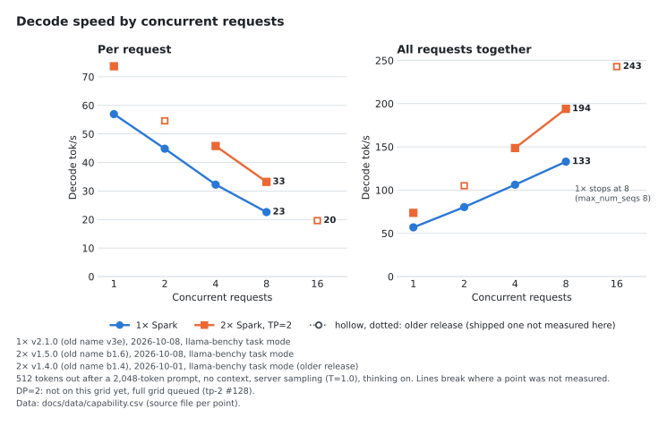
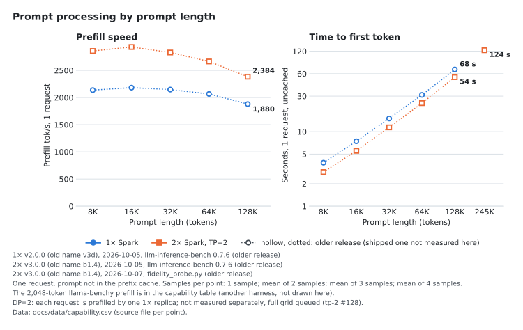

<div align="center">

# Qwen3.8-Flash-Next on one DGX Spark

NVFP4 Qwen3.8-Flash-Next on vLLM V2 with b12x kernels and 4-token MTP on a single GB10 (TP=1), launched with
sparkrun. 262,144-token context, OpenAI-compatible API. Experimental: NVFP4 GDN weights for decode, the PLE table read
through the page cache, and a retrained MTP drafter.<br>
Two Sparks: one TP=2 cluster or one copy of this recipe per Spark behind a router (DP=2), both in the
[tp-2 repo](https://github.com/ursuciprian/qwen3.8-flash-next-dgx-spark-tp-2).

[](#quality-gate)
[](#quality-gate)
[](#quality-gate)
[](#quality-gate)
<br>
[](VERSIONS.md)
[](#how-it-works)
[](LICENSE)

</div>

[Capabilities](#capabilities-at-a-glance) · [Which setup](#which-setup-should-i-use) · [Charts](#charts) · [Quick start](#quick-start) · [Quality gate](#quality-gate) · [Requirements](#requirements) · [Known limits](#known-limits) · [Releases](#releases) · [How I measure](#how-i-measure) · [Troubleshooting](#troubleshooting)

## Capabilities at a glance

Shipped releases: 1× v3.0.0 (old name v3e) and 2× v3.1.0 (old name b1.6), both from 2026-10-08. Every number carries a letter that names the
release, the date and the run it comes from. Where the shipped release has no measurement yet, the table shows the
newest release that has one; a full grid of the shipped releases is queued ([tp-2 #128](https://github.com/ursuciprian/qwen3.8-flash-next-dgx-spark-tp-2/issues/128)).
Decode rows are aggregate over all requests unless marked "each"; sampling is the server default (temperature 1.0,
thinking on) unless the run says otherwise. Same table in both repos.

<!-- capability-table:start (scripts/make_charts.py writes this block) -->
| | 1× Spark | 2× Spark, TP=2 | 2× Spark, DP=2 |
|---|---|---|---|
| Decode tok/s, 1 request | 56.9 <sup>a</sup> | 73.7 <sup>b</sup> | not measured |
| Decode tok/s, 4 requests: each / total | 32.2 <sup>a</sup> / 106.2 <sup>a</sup> | 45.8 <sup>b</sup> / 148.7 <sup>b</sup> | not measured |
| Decode tok/s, 8 requests: each / total | 22.6 <sup>a</sup> / 132.9 <sup>a</sup> | 33.2 <sup>b</sup> / 194.0 <sup>b</sup> | not measured |
| Decode tok/s, 16 requests: each / total | over the cap (max_num_seqs 8) | 19.6 <sup>c</sup> / 242.8 <sup>c</sup> | not measured |
| Prefill tok/s at 2K / 16K / 64K / 128K prompt, 1 request | 1,782 <sup>a</sup> / 2,079 <sup>a</sup> / 2,066 <sup>d</sup> / 1,880 <sup>d</sup> | 2,833 <sup>b</sup> / 2,931 <sup>e</sup> / 2,664 <sup>e</sup> / 2,384 <sup>e</sup> | not measured |
| Time to first token at 2K / 16K / 64K / 128K, uncached, s | 1.2 <sup>a</sup> / 7.9 <sup>a</sup> / 31.2 <sup>d</sup> / 68.4 <sup>d</sup> | 0.7 <sup>b</sup> / 5.5 <sup>e</sup> / 24.2 <sup>e</sup> / 54.0 <sup>e</sup> | not measured |
| Decode, mean ms per token at 1 / 8 requests (MTP emits several tokens per step) | 20 <sup>d</sup> / 46 <sup>d</sup> | 15 <sup>e</sup> / 31 <sup>e</sup> | not measured |
| Gap between streamed chunks p50 at 1 / 8 requests, ms | 56 <sup>d</sup> / 143 <sup>d</sup> | 41 <sup>e</sup> / 90 <sup>e</sup> | not measured |
| Decode tok/s total at 0 → 64K context, 1 request / 4 requests | 47.4 <sup>d</sup> → 56.9 <sup>d</sup> / 116.6 <sup>d</sup> → 111.8 <sup>d</sup> | 64.8 <sup>e</sup> → 77.8 <sup>e</sup> / 171.2 <sup>e</sup> → 165.4 <sup>e</sup> | not measured |
| Max context per request | 262,144 (recipe) | 262,144 (recipe) | 262,144 (recipe) |
| KV pool, tokens | 993,754 <sup>f</sup> | 3,650,419 <sup>g</sup> | 2 × 993,754, one pool per replica <sup>h</sup> |
| Requests of 262,144 tokens the pool holds (vLLM's count) | 3.79 <sup>f</sup> | 13.93 <sup>g</sup> | 2 × 3.79 <sup>h</sup> |
| Requests that fit the KV pool at 16K / 64K / 128K | 39.7 <sup>i</sup> / 14.1 <sup>i</sup> / 7.5 <sup>i</sup> | not measured | not measured |
| Quality gate: hardmode / TC-45 / retrieval to ~245K / stragglers | 91 <sup>j</sup> / 100 <sup>j</sup> / 20/20 (one of three ~245K seeds 19/20) <sup>j</sup> / none, c8-c16 <sup>j</sup> | 92 <sup>k</sup> / 100 <sup>k</sup> / 20/20 <sup>k</sup> / none, c8-c16 <sup>k</sup> | 93 <sup>l</sup> / 100 <sup>l</sup> / 20/20 <sup>l</sup> / none, c5-c16 <sup>l</sup> |

Releases and runs behind the numbers:

- <sup>a</sup> 1× v3.0.0 (old name v3e), 2026-10-08, shipped-image check, llama-benchy task mode ([files](results/tp1-v3e-hf-20261008/bench/))
- <sup>b</sup> 2× v3.1.0 (old name b1.6), 2026-10-08, promotion A/B, llama-benchy task mode ([files](https://github.com/ursuciprian/qwen3.8-flash-next-dgx-spark-tp-2/tree/main/results/k71-tp2-refit-pinned-plans-20261008-0921/screen/))
- <sup>c</sup> 2× v3.0.0 (old name b1.4), 2026-10-01, promotion A/B, llama-benchy task mode ([files](https://github.com/ursuciprian/qwen3.8-flash-next-dgx-spark-tp-2/tree/main/results/b1.4-20261001/))
- <sup>d</sup> 1× v2.0.0 (old name v3d), 2026-10-05, depth and prefill sweep, llm-inference-bench 0.7.6 ([files](results/tp1-v3d-20261005/bench/))
- <sup>e</sup> 2× v3.0.0 (old name b1.4), 2026-10-05, depth and prefill sweep, llm-inference-bench 0.7.6 ([files](https://github.com/ursuciprian/qwen3.8-flash-next-dgx-spark-tp-2/tree/main/results/lib-bench-20261005/tp2-b1.4/))
- <sup>f</sup> 1× v3.0.0 (old name v3e), 2026-10-08, serve log ([files](https://github.com/ursuciprian/qwen3.8-flash-next-dgx-spark-tp-2/tree/main/results/dp2-gate-k72-20261008-1135/))
- <sup>g</sup> 2× v3.1.0 (old name b1.6), 2026-10-08, serve log ([files](https://github.com/ursuciprian/qwen3.8-flash-next-dgx-spark-tp-2/tree/main/results/dp2-gate-k72-20261008-1135/))
- <sup>h</sup> DP=2 on 1× v3.0.0 (old name v3e), 2026-10-08, serve log ([files](https://github.com/ursuciprian/qwen3.8-flash-next-dgx-spark-tp-2/tree/main/results/dp2-gate-k72-20261008-1135/))
- <sup>i</sup> 1× v1.3.0 (old name v3c), 2026-10-05, kv-capacity page accounting, same 14 GiB pool in 1× v2.0.0 and v3.0.0 ([files](results/tp1-v3c-20261005/))
- <sup>j</sup> 1× v3.0.0 (old name v3e), 2026-10-07, promotion gate ([files](docs/BENCHMARKS.md))
- <sup>k</sup> 2× v3.1.0 (old name b1.6), 2026-10-08, promotion gate ([files](https://github.com/ursuciprian/qwen3.8-flash-next-dgx-spark-tp-2/blob/main/docs/BENCHMARKS.md))
- <sup>l</sup> DP=2 on 1× v3.0.0 (old name v3e), 2026-10-08, quality gate through the router ([files](https://github.com/ursuciprian/qwen3.8-flash-next-dgx-spark-tp-2/tree/main/results/dp2-gate-k72-20261008-1135/))
<!-- capability-table:end -->

Full grids, every build and method: [docs/BENCHMARKS.md](docs/BENCHMARKS.md). Release names and contents:
[VERSIONS.md](VERSIONS.md).

## Which setup should I use

| You run | Pick | Why, measured |
|---|---|---|
| One Spark | 1× (this repo) | Up to 8 requests at once (`max_num_seqs` 8), 993,754-token KV pool: about 39.7 requests fit at 16K, 14.1 at 64K, 7.5 at 128K |
| Two Sparks, one request at a time (chat, one coding agent) | [2× TP=2](https://github.com/ursuciprian/qwen3.8-flash-next-dgx-spark-tp-2) | One request decodes at 73.7 tok/s against 56.9 on 1× (llama-benchy tg512); on 36 coding prompts the median was 106 against 73 tok/s (T=0, thinking off) |
| Two Sparks, many agents or users at once | DP=2: this recipe on each Spark + the [router](https://github.com/ursuciprian/qwen3.8-flash-next-dgx-spark-tp-2/blob/main/tools/dp2/README.md) | In an agent replay (one boot each, same sessions on both) DP=2 finished all six agent workloads 29–37% sooner than TP=2, with 0 preemptions on both |
| Two Sparks, more long contexts at once than one Spark holds | 2× TP=2 | One KV pool of 3,650,419 tokens against 993,754 per 1× replica |

The agent replay (tools on, thinking off, temperature 0.6, all sessions starting together) against
2× v3.1.0 (old name b1.6) and DP=2 on two 1× v3.0.0 (old name v3e) replicas, 2026-10-08:

| Workload | Wall time, TP=2 / DP=2 (s) | First-turn TTFT mean, TP=2 / DP=2 (s) | Follow-up TTFT mean, TP=2 / DP=2 (s) |
|---|:---:|:---:|:---:|
| 8 sessions × 6 turns from ~32K tokens | 157.1 / 111.6 | 64.9 / 49.5 | 5.0 / 4.5 |
| 16 sessions × 4 turns from ~32K tokens | 255.6 / 173.3 | 123.8 / 88.1 | 9.4 / 8.7 |
| 4 sessions × 2 turns from ~128K tokens | 225.7 / 141.9 | 166.3 / 136.6 | 5.6 / 2.4 |
| 8 sessions × 2 turns from ~128K tokens | 452.5 / 284.6 | 285.8 / 210.8 | 8.4 / 6.0 |
| 12 sessions × 2 turns from ~128K tokens | 680.2 / 428.4 | 411.0 / 284.0 | 32.5 / 7.3 |
| 16 sessions × 2 turns from ~128K tokens | 901.7 / 567.8 | 519.4 / 360.7 | 63.4 / 8.1 |

Full table and the router's limits (no failover):
[DP=2 in the tp-2 repo](https://github.com/ursuciprian/qwen3.8-flash-next-dgx-spark-tp-2/blob/main/docs/BENCHMARKS.md#dp2-against-2-tp2-production-gate-2026-10-08).

## Charts

Each chart is rendered by `uv run scripts/make_charts.py` from [`docs/data/capability.csv`](docs/data/capability.csv),
where every point names its raw file (`1x:` paths are in this repo, `2x:` paths in the tp-2 repo). The footnote of
each chart gives the release, date and harness of every line. PNG copies sit next to the SVGs in
[`docs/img/`](docs/img/).

How fast is one request, and how much do all requests get together?



How fast is the prompt read, and how long until the first token?



Does decode slow down with a long context already in the prompt?


Coding, one request at a time:


Two Sparks, many agent sessions at once: TP=2 or DP=2?


What each release added, on the cell it was promoted for:


## Quick start

Needs [sparkrun](https://github.com/eugr/sparkrun) ≥ 0.3.6.

```sh
sparkrun registry add https://github.com/ursuciprian/qwen3.8-flash-next-1x-dgx-spark
sparkrun run qwen3.8-flash-next-1x-dgx-spark --hosts <spark> --solo
```

Base URL `http://<spark>:8000/v1`, model `qwen3.8-flash-next`.

The recipe serves its own checkpoint, about 98 GB. A fresh download took about 3 h 15 min on my link (~8.6 MB/s).
Download it on the Spark before the first boot, together with the two files of the base checkpoint that the recipe
uses for prefill (2.6 GiB):

```sh
hf download ursuciprian/Qwen3.8-Flash-Next-NVFP4-GDN-MSE --revision 16c9bd54788d12390838a65ce4a4ecda97fa5f1d
hf download local-inference-lab/Qwen3.8-Flash-Next-NVFP4 --revision 7c4f1bc1a2d6847e0cbc01ac6b823f00251de8dd \
  model-00035-of-00036.safetensors model.safetensors.index.json
```

`sparkrun run` returns before the engine is ready. Wait for health, then check that the reply has both reasoning and
an answer:

```sh
H=http://<spark>:8000
until [ "$(curl -s -o /dev/null -w '%{http_code}' $H/health)" = 200 ]; do sleep 10; done
curl -s $H/v1/chat/completions -H 'Content-Type: application/json' -d '{
  "model":"qwen3.8-flash-next","max_tokens":1024,
  "messages":[{"role":"user","content":"Write a Python function that reverses a string."}]}' \
| python3 -c "import json,sys; m=json.load(sys.stdin)['choices'][0]['message']
print('reasoning:', len(m.get('reasoning') or m.get('reasoning_content') or ''), 'chars')
print('content  :', (m.get('content') or '')[:300])"
```

Empty `content` with long reasoning means `max_tokens` ran out inside thinking; garbled text means a checkpoint
mismatch (see [Troubleshooting](#troubleshooting)). Optional long-context check (stdlib Python), expect `exact 20` at
both depths:

```sh
git clone https://github.com/ursuciprian/qwen3.8-flash-next-1x-dgx-spark && cd qwen3.8-flash-next-1x-dgx-spark
python3 scripts/fidelity_probe.py --base $H --model qwen3.8-flash-next --depths 8000,32000
```

The server binds 0.0.0.0 with no API key: keep it on a trusted network or put a proxy with auth in front. Stop with
`sparkrun stop --all`. To upgrade, run `sparkrun registry update qwen38-flashnext-1x` first: sparkrun caches
registries and does not refresh them on `run`.

> Moved here on 2026-10-08 from [qwen3.8-flash-next-dgx-spark-tp-2](https://github.com/ursuciprian/qwen3.8-flash-next-dgx-spark-tp-2),
> which keeps a copy of this recipe so existing `sparkrun run` setups keep working. If both registries are added,
> pick this one with `sparkrun run @qwen38-flashnext-1x/qwen3.8-flash-next-1x-dgx-spark --hosts <spark> --solo`.

## Quality gate

A release ships only if it passes every check.

| Check | Tool | 1× v3.0.0, both Sparks |
|---|---|:---:|
| Hard multi-step tool use (88 scenarios, thinking on, T=0); gate ≥ 88 | [tool-eval-bench](https://github.com/SeraphimSerapis) `--hardmode` | 91/100 |
| `tool_choice=required` compliance, 5 trials | TC-45 | 100/100 |
| Long-context tool-call retrieval, 20 needles per depth, prompts of ~15.7K / 61.7K / 122.6K / 245K tokens | [`scripts/fidelity_probe.py`](scripts/fidelity_probe.py) | 20/20 at every depth; one of the three ~245K seeds on dgx-01 19/20 (119/120 overall) |
| Batch stragglers | [`scripts/straggler_probe.py`](scripts/straggler_probe.py) | none at c8–c16, 0 preemptions |
| MTP acceptance per draft position (numerics canary) | paired decode probe | +0.036 to +0.058 per position, the intended effect of the new drafter |
| Host memory headroom during the gate | `MemAvailable` | min 13.92 GiB |
| Image seed: first boot measures 0 b12x plans | [`scripts/check_seed.py`](scripts/check_seed.py) | pass |

The previous release's gate (logprob agreement, DevOps task set) and every earlier one:
[docs/BENCHMARKS.md](docs/BENCHMARKS.md). Not yet measured at the `medium` thinking default: MMLU-Pro, GSM8K,
IFEval, LiveCodeBench.

## Requirements

| | |
|---|---|
| **Hardware** | 1× DGX Spark (GB10, 128 GB unified); checkpoint on local NVMe (the PLE table is read through the page cache) |
| **Launcher** | sparkrun ≥ 0.3.6 |
| **Disk** | ~128 GB (97.7 GiB checkpoint + 2.6 GiB MXFP8 shard + image) |
| **Kernel** | No NCCL at TP=1, so the `7.0.0-1019-nvidia` NCCL regression of the 2× recipe does not apply |
| **Boot** | ~3 min (171 s) with the compile cache from the image and a warm page cache, once the checkpoint is downloaded |
| **Concurrency** | `max_num_seqs` 8, KV pool 14 GiB (993,754 tokens, 3.79x at 262,144) |

Checkpoint: [`ursuciprian/Qwen3.8-Flash-Next-NVFP4-GDN-MSE`](https://huggingface.co/ursuciprian/Qwen3.8-Flash-Next-NVFP4-GDN-MSE)
@ `16c9bd54` (v3.0.0, drafter D1; v2.0.0: `244cb6fe`, drafter D0). It is the NVFP4 checkpoint
[`local-inference-lab/Qwen3.8-Flash-Next-NVFP4`](https://huggingface.co/local-inference-lab/Qwen3.8-Flash-Next-NVFP4)
@ `7c4f1bc1` with the GDN projections in weight-only NVFP4 and, since `16c9bd54`, a retrained MTP drafter. Its model
card covers what changed, how it was built and the license (Qwen Community License 1.0). The recipe also fetches
shard 35 and the index of `7c4f1bc1` (2.6 GiB) for the MXFP8 prefill copy. Image and video input are not tested.

## Known limits

- The 14 GiB KV pool holds ~7.5 requests at 128K, so 8 concurrent 128K requests can wait for KV space. 8 × 64K fits.
- On a first boot without a usable plan seed, it autotunes and compiles every kernel: ~30 min, with host MemAvailable
  down to 3.8 GiB for about a minute (earlyoom triggers at ~2.4 GiB). The images ship the plan seed and compile
  cache, so a normal first boot skips this. Close other memory-heavy work during the first boot.
- In steady state there is ~14 GiB MemAvailable (lowest 13.3 GiB in the benchmark run), most of it PLE page cache.
- The b12x plan seed and the compile cache are keyed by the model's snapshot path, so they match only the pinned
  checkpoint revision. Serving another revision or a local copy of the files autotunes and compiles on its first boot.
- The recipe and its rollback serve different checkpoint revisions and keep one cache each, so the first boot of the
  other one is not warm.
- Hardmode still fails a few multi-step scenarios (e.g. TC-30, TC-68, TC-74, TC-88) on every release.
- Above 8 requests: a `max_num_seqs` 32 run (quality gate not run at that cap, v2.0.0) reached 198.7 tok/s coding
  at 32 requests, max of 3 runs; a boot at `max_num_seqs` 16 was stopped by the 4 GiB memory guard
  ([high concurrency](docs/BENCHMARKS.md#high-concurrency-max_num_seqs-32-2026-10-05)).

## Recipes

| Recipe | Release | Image | Use |
|---|---|---|---|
| [`qwen3.8-flash-next-1x-dgx-spark`](recipes/qwen3.8-flash-next/qwen3.8-flash-next-1x-dgx-spark.yaml) | v3.0.0 (old name v3e) | `tp1-v3e-hf-20261008-21e0b201-5dad364d-warm` | Default (checkpoint @ `16c9bd54`, drafter D1) |
| [`qwen3.8-flash-next-1x-dgx-spark-previous`](recipes/qwen3.8-flash-next/qwen3.8-flash-next-1x-dgx-spark-previous.yaml) | v2.0.0 (old name v3d) | `tp1-v3d-hf-20261005-21e0b201-5dad364d-warm` | Rollback (checkpoint @ `244cb6fe`, drafter D0) |

Each recipe's header lists every change since the first release with its measured delta. Earlier recipes:
[archive/recipes/](archive/recipes/README.md). Renames: [recipes/RENAMES.md](recipes/RENAMES.md).

## Releases

Releases use semantic versions per repo; [VERSIONS.md](VERSIONS.md) lists every shipped release with its old build
name, date, what changed, its measured delta and its manifest (image digest, vLLM and b12x commits, checkpoint,
drafter, plan seed). Each release's own A/B against the one before it is in the [release-gains chart](#charts) and in
[docs/BENCHMARKS.md](docs/BENCHMARKS.md). Arms that were screened and not promoted: [results/README.md](results/README.md).

## How I measure

- Candidate builds are screened with [Thunderdome](docs/THUNDERDOME.md): one arm per Spark, control and candidate
  booted alternately, 2 passes, T=0 decode probes at 1/4/8 requests and at 16K context, plus llama-benchy at
  temperature 1.0. Noise band = the control's boot-to-boot spread, at least 1%.
- To be promoted, a build must pass the gate, be faster beyond noise in at least one coding or counting cell, and be
  slower beyond noise in no cell at 1–4 requests ([`scripts/arm_verdict.py`](scripts/arm_verdict.py)).
- MTP acceptance per draft position is compared cell by cell as a numerics canary; logprob agreement against the
  previous build must sit within self-noise.
- Copy-heavy and counting workloads accept nearly every draft and show the decode ceiling of MTP; the coding grid
  (llama-benchy task mode, thinking on) is the rate an agent sees. Every table names its workload.

Index of every run and verdict: [results/README.md](results/README.md). The issue history up to 2026-10-08 is in the
[tp-2 repo](https://github.com/ursuciprian/qwen3.8-flash-next-dgx-spark-tp-2/issues?q=label%3Asingle-spark); open
single-Spark issues are [here](https://github.com/ursuciprian/qwen3.8-flash-next-1x-dgx-spark/issues).

## How it works

- The 26.8 GiB PLE n-gram table is read through the page cache from the checkpoint files (`VLLM_PLE_MMAP=1`), with a
  WILLNEED pass before each decode gather and a 50 ms NVMe keepalive, so ~72 GiB of other weights fit on one GB10.
- One GDN prefill staging buffer shared by all 36 GDN layers frees ~8.8 GiB, which goes to a 14 GiB KV pool, and
  compact MTP draft records cut each request's GDN state blocks from 185 to 37.
- The GDN projections decode from weight-only NVFP4 and switch to an MXFP8 copy for calls of 41+ rows.
- b12x kernels cover NVFP4 MoE, MXFP8 linears, GDN (36 layers) and QSA sparse attention (12 layers), with an
  autotuned plan cache and the torch compile cache baked into each image ([`docker/b0-warm/`](docker/b0-warm/)).
- MTP ×4 uses probabilistic drafts over a 131k-id draft vocabulary; rejection sampling keeps the output distribution
  unchanged. The drafter of v3.0.0 (D1) was retrained on the served model's own outputs
  ([`tools/mtp_refit/`](tools/mtp_refit/)).

Every flag and environment variable, with the reason for it, is in the recipe header. Engine-wide configuration,
image provenance and rejected experiments shared with the 2× recipe:
[REFERENCE.md](https://github.com/ursuciprian/qwen3.8-flash-next-dgx-spark-tp-2/blob/main/docs/REFERENCE.md) and
[ENGINEERING.md](https://github.com/ursuciprian/qwen3.8-flash-next-dgx-spark-tp-2/blob/main/docs/ENGINEERING.md) in the
tp-2 repo.

## Thinking effort

The recipe sets the server default to `reasoning_effort: medium`. On my DevOps task set (2× Spark), b1.2 at the
template default `xhigh` passed 42.5% of checks with 23/42 runaway-thinking runs and a 246 s median per task; b1.4 at
`medium` passed 95.9% with 0/42 runaway and 33 s. A request can still ask for `xhigh` or `low`;
`"reasoning_effort": "none"` turns thinking off. For hard reasoning problems `xhigh` per request helps: on the
hotel-lights check, v3c (old name) went from 21/32 at `medium` to 31/31 completed runs; allow a long client timeout, since most
of those answers took over 30 minutes at 8 concurrent requests. Override table:
[REFERENCE.md](https://github.com/ursuciprian/qwen3.8-flash-next-dgx-spark-tp-2/blob/main/docs/REFERENCE.md#thinking-effort).

## Troubleshooting

| Symptom | Fix |
|---|---|
| `/health` silent for minutes | Expected on a cold boot. `sparkrun logs qwen3.8-flash-next-1x-dgx-spark -f` |
| OOM / earlyoom at first boot | Plan seed not used, so it autotunes; see [Known limits](#known-limits) |
| `Recipe ... matches multiple registries` | Both this registry and the tp-2 one are added; use `@qwen38-flashnext-1x/qwen3.8-flash-next-1x-dgx-spark` |
| Garbled output | Checkpoint mismatch: the serve log must show the pinned `snapshots/16c9bd54...` (or `244cb6fe...` for `-previous`) |
| Empty `content`, long reasoning | `max_tokens` ran out during thinking; raise it or send `"reasoning_effort": "low"` |
| Old release boots after an upgrade | `sparkrun registry update qwen38-flashnext-1x` |
| Anything else | Try the `-previous` recipe, then open an issue with `sparkrun logs <recipe> -a` |

## Docs

| | |
|---|---|
| [VERSIONS.md](VERSIONS.md) | Release names, old build names, manifests |
| [docs/BENCHMARKS.md](docs/BENCHMARKS.md) | Full benchmark and quality tables for every build, method, history |
| [docs/THUNDERDOME.md](docs/THUNDERDOME.md) | The screen every candidate build runs |
| [results/](results/README.md) | Every raw measurement and verdict |
| [archive/](archive/recipes/README.md) | Superseded recipes (not listed by sparkrun) |
| [tools/mtp_refit/](tools/mtp_refit/) | MTP drafter refit pipeline behind v3.0.0 |

## Credits

This build stands on these projects:

- [local-inference-lab](https://github.com/local-inference-lab): the vLLM fork my branches start from, the b12x kernels (NVFP4 MoE, GDN, QSA) and the NVFP4 checkpoint this checkpoint is derived from.
- [Qwen](https://huggingface.co/Qwen/Qwen3.8-Flash-Next): the base model, under the Qwen Community License 1.0.
- [eugr](https://github.com/eugr): spark-vllm-docker (the image base), sparkrun (the launcher), and llama-benchy (the base of my benchmark fork).
- [tonyd2wild](https://github.com/tonyd2wild): the bench_sweep counting harness behind the counting numbers.
- [SeraphimSerapis](https://github.com/SeraphimSerapis): tool-eval-bench, which runs the hardmode and TC-45 quality gate.

## License

Apache-2.0, see [`LICENSE`](LICENSE). The vLLM overlays under `archive/mods/` keep their upstream Apache-2.0 headers.
Model weights are not part of this repo and keep their own license (Qwen Community License 1.0; see the checkpoint's
model card).
