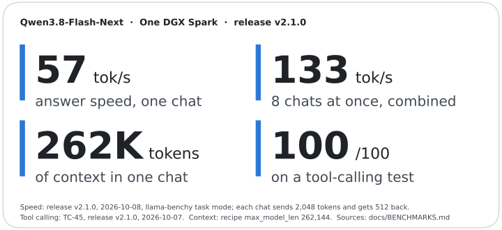
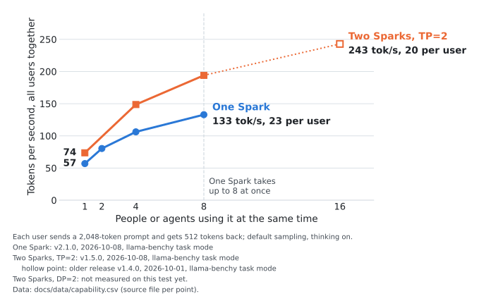
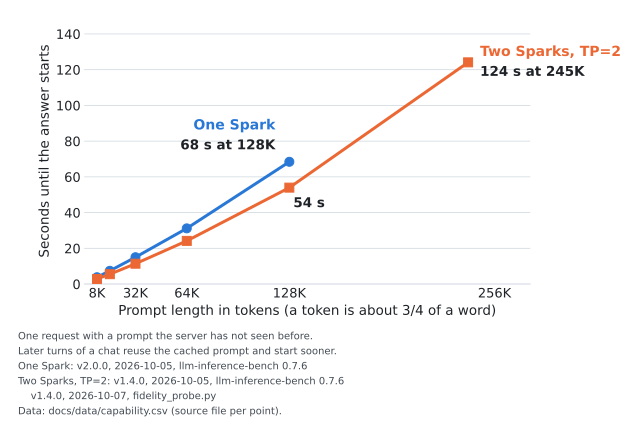
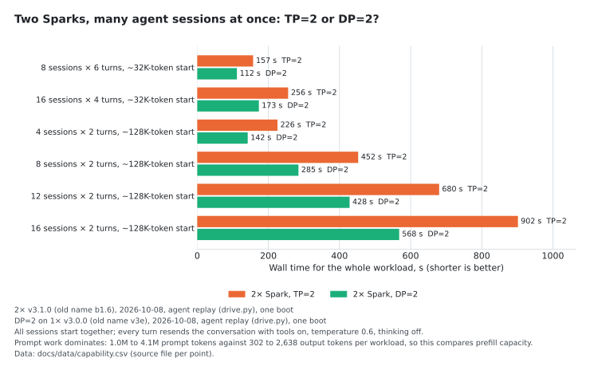

# Qwen3.8-Flash-Next on one DGX Spark

A ready-made recipe that runs Qwen3.8-Flash-Next on one NVIDIA DGX Spark as a private, OpenAI-compatible
server, for chat, coding and agents. Two commands to start.

<!-- hero:start (scripts/make_charts.py writes this block) -->


<sub>tok/s = tokens per second; a token is about 3/4 of a word. Coding: coding_probe.py, up to 768 tokens out, median decode speed of 36 prompts (Python, C++, Rust, Go) sent one at a time, temperature 0, thinking off, release v2.0.0, 2026-10-06; coding replies repeat code and names, so the built-in draft model guesses more tokens right; at the server defaults (thinking on) the same prompts give 60 tok/s. Chat: release v2.1.0, 2026-10-08, each chat sends 2,048 tokens and gets 512 back at the server defaults (temperature 1.0, thinking on), the everyday floor. Tool calls: release v2.1.0, 2026-10-07. How each was measured: [docs/BENCHMARKS.md](docs/BENCHMARKS.md).</sub>
<!-- hero:end -->

## Quick start

You need one DGX Spark with about 130 GB free on its internal SSD, and [sparkrun](https://github.com/eugr/sparkrun)
0.3.6 or newer. Replace `<spark>` with the Spark's hostname or IP; `--solo` runs it on that one machine.

```sh
sparkrun registry add https://github.com/ursuciprian/qwen3.8-flash-next-1x-dgx-spark
sparkrun run qwen3.8-flash-next-1x-dgx-spark --hosts <spark> --solo
```

The first start downloads the model and the image (about 130 GB on disk; on a slow link, fetch the model
beforehand, see below). Once it is on
disk, a start takes about 3 minutes. `sparkrun run` returns before the server is ready. Once
`http://<spark>:8000/health` answers, point any OpenAI client at `http://<spark>:8000/v1`, model `qwen3.8-flash-next`:

```sh
curl http://<spark>:8000/v1/chat/completions -H 'Content-Type: application/json' \
  -d '{"model": "qwen3.8-flash-next", "messages": [{"role": "user", "content": "Hello"}]}'
```

The server has no API key, so keep it on a trusted network.

<details>
<summary>Download the model beforehand, check that it works, stop, upgrade</summary>

The recipe serves its own checkpoint, about 98 GB. A fresh download took about 3 h 15 min on my link (~8.6 MB/s).
Download it on the Spark before the first boot, together with the two files of the base checkpoint that the recipe
uses for prefill (2.6 GiB):

```sh
hf download ursuciprian/Qwen3.8-Flash-Next-NVFP4-GDN-MSE --revision 16c9bd54788d12390838a65ce4a4ecda97fa5f1d
hf download local-inference-lab/Qwen3.8-Flash-Next-NVFP4 --revision 7c4f1bc1a2d6847e0cbc01ac6b823f00251de8dd \
  model-00035-of-00036.safetensors model.safetensors.index.json
```

`sparkrun run` returns before the engine is ready. Wait for health, then check that the reply has both reasoning and
an answer:

```sh
H=http://<spark>:8000
until [ "$(curl -s -o /dev/null -w '%{http_code}' $H/health)" = 200 ]; do sleep 10; done
curl -s $H/v1/chat/completions -H 'Content-Type: application/json' -d '{
  "model":"qwen3.8-flash-next","max_tokens":1024,
  "messages":[{"role":"user","content":"Write a Python function that reverses a string."}]}' \
| python3 -c "import json,sys; m=json.load(sys.stdin)['choices'][0]['message']
print('reasoning:', len(m.get('reasoning') or m.get('reasoning_content') or ''), 'chars')
print('content  :', (m.get('content') or '')[:300])"
```

Empty `content` with long reasoning means `max_tokens` ran out inside thinking; garbled text means a checkpoint
mismatch (see Troubleshooting under Details below). Optional long-context check (stdlib Python), expect `exact 20` at
both depths:

```sh
git clone https://github.com/ursuciprian/qwen3.8-flash-next-1x-dgx-spark && cd qwen3.8-flash-next-1x-dgx-spark
python3 scripts/fidelity_probe.py --base $H --model qwen3.8-flash-next --depths 8000,32000
```

The server binds 0.0.0.0 with no API key: keep it on a trusted network or put a proxy with auth in front. Stop with
`sparkrun stop --all`. To upgrade, run `sparkrun registry update qwen38-flashnext-1x` first: sparkrun caches
registries and does not refresh them on `run`.

Request traces: the recipe has vLLM send one OpenTelemetry span per finished request (queue, prefill and
decode time, token counts; no prompt or reply text) over OTLP/HTTP to my MLflow server at `192.168.68.59:5050`,
service name `qwen3.8-flash-next-1x`. That address only exists on my network: elsewhere the export fails on a background
thread with a warning line per batch. To send the spans to your own MLflow or OpenTelemetry collector, add
`-o otlp_traces_endpoint=http://<host>:<port>/v1/traces -e OTEL_EXPORTER_OTLP_TRACES_HEADERS=x-mlflow-experiment-id=<id>`
to `sparkrun run`.

> Moved here on 2026-10-08 from [qwen3.8-flash-next-dgx-spark-tp-2](https://github.com/ursuciprian/qwen3.8-flash-next-dgx-spark-tp-2),
> which keeps a copy of this recipe so existing `sparkrun run` setups keep working. If both registries are added,
> pick this one with `sparkrun run @qwen38-flashnext-1x/qwen3.8-flash-next-1x-dgx-spark --hosts <spark> --solo`.

</details>

## How fast is it?

<!-- speed-chart:start (scripts/make_charts.py writes this block) -->


<sub>Solid lines (chat): each user sends a 2,048-token prompt and gets 512 tokens back; default sampling, thinking on. Total = all tokens written per second, including the time spent reading prompts; each reply = how fast one answer streams once it has started, so it is more than total / users.<br>One Spark: release v2.1.0, 2026-10-08, llama-benchy task mode<br>Two Sparks, TP=2: release v2.0.0, 2026-10-09, llama-benchy task mode<br>One Spark, star (coding): v2.0.0, 2026-10-06, coding_probe.py, up to 768 tokens out; median decode speed of 36 coding prompts sent one at a time, temperature 0, thinking off; at the server defaults (thinking on) the same prompts give 60 tok/s<br>Two Sparks, DP=2: not measured on this test yet.<br>Versions are numbered per setup. Data: [docs/data/capability.csv](docs/data/capability.csv), with the source file of every point.</sub>
<!-- speed-chart:end -->

The more people use it at once, the more text it writes in total, while each reply streams more slowly. One Spark
runs up to 8 chats at once, two Sparks up to 16; more requests wait in line.

## How long until the first word?

<!-- first-token-chart:start (scripts/make_charts.py writes this block) -->


<sub>One request with a prompt the server has not seen before. Later turns of a chat reuse the cached prompt and start sooner.<br>One Spark: release v2.0.0, 2026-10-05, llm-inference-bench 0.7.6<br>Two Sparks, TP=2: release v1.4.0, 2026-10-05, llm-inference-bench 0.7.6; v1.4.0, 2026-10-07, fidelity_probe.py<br>One Spark: not measured above 128K yet.<br>Data: [docs/data/capability.csv](docs/data/capability.csv), with the source file of every point.</sub>
<!-- first-token-chart:end -->

Long prompts take a while to read the first time. In a running chat, only the new part of the prompt is read.

## Which setup do I need?


**One Spark: this recipe.** It serves up to 8 chats at once.
<br clear="left">


**Two Sparks, one person or a few long chats: TP=2.** The
[two-Spark recipe](https://github.com/ursuciprian/qwen3.8-flash-next-dgx-spark-tp-2) makes the two Sparks work as
one server, so each chat gets faster and more long chats fit at once.
<br clear="left">


**Two Sparks, many agents at once: DP=2.** Each Spark runs this recipe and a small
[router](https://github.com/ursuciprian/qwen3.8-flash-next-dgx-spark-tp-2/blob/main/tools/dp2/README.md) splits the
chats between them. In my agent tests it finished the same work sooner than TP=2 ([chart](docs/img/agents.svg)).
<br clear="left">

## What's inside

- The model: Qwen3.8-Flash-Next, stored at 4 and 8 bits per weight so it fits (NVFP4 and MXFP8), plus a draft head I
  retrained so more of its guesses are accepted.
- Fitting on one Spark: a 26.8 GiB lookup table inside the model is read from the SSD instead of GPU memory, which
  leaves room for more and longer chats.
- Several tokens per step: the draft head guesses 4 tokens ahead and the model checks them in one pass; the output
  follows the same distribution as without it (speculative decoding).
- Software: vLLM with kernels written for the Spark's GB10 chip (b12x), in a prebuilt image with the kernel tuning
  already done.
- Thinking on by default at `medium` effort, tool calling, 262,144-token context, OpenAI-compatible API.

## Quality checks

<!-- quality:start (scripts/make_charts.py writes this block) -->
-  When a request requires a tool call, the reply makes one (TC-45, 5 trials).
-  Score 91/100 on 88 hard multi-step tool-use scenarios (pass mark: 88/100).
-  Finds 20 facts hidden in a long prompt and returns each through a tool call: 20 of 20 in every run except one of three ~245K prompts (19 of 20).
-  No request falls behind the others when 8 to 16 are sent at once; it runs 8 at a time and queues the rest.

Gate run: release v2.1.0, 2026-10-07. Every release passes this gate before it ships.
<!-- quality:end -->

Full gate tables: [docs/BENCHMARKS.md](docs/BENCHMARKS.md).

## Details

### More charts

<details>
<summary>Decode speed with a long context, coding speed, TP=2 against DP=2 for agents, and what each release added</summary>





</details>

### Every number and where it comes from

<details>
<summary>Full capability table for one Spark, two Sparks at TP=2 and two Sparks at DP=2, with the run behind each number</summary>

Where the shipped release has no measurement yet, the table shows the newest release that has one; a full grid of the
shipped releases is queued ([tp-2 #128](https://github.com/ursuciprian/qwen3.8-flash-next-dgx-spark-tp-2/issues/128)).
Decode rows are the total over all requests unless marked "each"; sampling is the server default (temperature 1.0,
thinking on) unless the run says otherwise. Charts, hero card and this table are written by
`uv run scripts/make_charts.py` from [`docs/data/capability.csv`](docs/data/capability.csv), where every point lists
its raw file (`1x:` paths are in this repo, `2x:` paths in the
[two-Spark repo](https://github.com/ursuciprian/qwen3.8-flash-next-dgx-spark-tp-2)). Full grids for every build: [docs/BENCHMARKS.md](docs/BENCHMARKS.md).

<!-- capability-table:start (scripts/make_charts.py writes this block) -->
| | One Spark | Two Sparks, TP=2 | Two Sparks, DP=2 |
|---|---|---|---|
| Decode tok/s, 1 request | 56.9 <sup>a</sup> | 89.3 <sup>b</sup> | not measured |
| Decode tok/s, 4 requests: each / total | 32.2 <sup>a</sup> / 106.2 <sup>a</sup> | 50.2 <sup>b</sup> / 161.4 <sup>b</sup> | not measured |
| Decode tok/s, 8 requests: each / total | 22.6 <sup>a</sup> / 132.9 <sup>a</sup> | 33.1 <sup>b</sup> / 187.9 <sup>b</sup> | not measured |
| Decode tok/s, 16 requests: each / total | over the cap (max_num_seqs 8) | 22.1 <sup>c</sup> / 236.6 <sup>c</sup> | not measured |
| Coding, 36 prompts one at a time: median (max) decode tok/s, T=0 / server defaults | 73 <sup>d</sup> (82) <sup>d</sup> / 60 <sup>d</sup> (67) <sup>d</sup> | 106 <sup>e</sup> (121) <sup>e</sup> / 88 <sup>e</sup> (97) <sup>e</sup> | not measured |
| Copy-heavy (MTP accepts nearly every draft) total tok/s at 1 / 4 / 8 requests, max of 3 rounds | 81 <sup>f</sup> / 188 <sup>f</sup> / 282 <sup>f</sup> | 117 <sup>g</sup> / 290 <sup>g</sup> / 439 <sup>g</sup> | not measured |
| Prefill tok/s at 2K / 16K / 64K / 128K prompt, 1 request | 1,782 <sup>a</sup> / 2,079 <sup>a</sup> / 2,066 <sup>h</sup> / 1,880 <sup>h</sup> | 2,831 <sup>b</sup> / 2,931 <sup>i</sup> / 2,664 <sup>i</sup> / 2,384 <sup>i</sup> | not measured |
| Time to first token at 2K / 16K / 64K / 128K, uncached, s | 1.2 <sup>a</sup> / 7.9 <sup>a</sup> / 31.2 <sup>h</sup> / 68.4 <sup>h</sup> | 0.7 <sup>b</sup> / 5.5 <sup>i</sup> / 24.2 <sup>i</sup> / 54.0 <sup>i</sup> | not measured |
| Decode, mean ms per token at 1 / 8 requests (MTP emits several tokens per step) | 20 <sup>h</sup> / 46 <sup>h</sup> | 15 <sup>i</sup> / 31 <sup>i</sup> | not measured |
| Gap between streamed chunks p50 at 1 / 8 requests, ms | 56 <sup>h</sup> / 143 <sup>h</sup> | 41 <sup>i</sup> / 90 <sup>i</sup> | not measured |
| Decode tok/s total at 0 → 64K context, 1 request / 4 requests | 47.4 <sup>h</sup> → 56.9 <sup>h</sup> / 116.6 <sup>h</sup> → 111.8 <sup>h</sup> | 64.8 <sup>i</sup> → 77.8 <sup>i</sup> / 171.2 <sup>i</sup> → 165.4 <sup>i</sup> | not measured |
| Max context per request | 262,144 (recipe) | 262,144 (recipe) | 262,144 (recipe) |
| KV pool, tokens | 993,754 <sup>j</sup> | 3,527,297 <sup>k</sup> | 2 × 993,754, one pool per replica <sup>l</sup> |
| Requests of 262,144 tokens the pool holds (vLLM's count) | 3.79 <sup>j</sup> | 13.46 <sup>k</sup> | 2 × 3.79 <sup>l</sup> |
| Requests that fit the KV pool at 16K / 64K / 128K | 39.7 <sup>m</sup> / 14.1 <sup>m</sup> / 7.5 <sup>m</sup> | not measured | not measured |
| Quality gate: hardmode / TC-45 / retrieval to ~245K / stragglers | 91 <sup>n</sup> / 100 <sup>n</sup> / 20/20 (one of three ~245K seeds 19/20) <sup>n</sup> / none, c8-c16 <sup>n</sup> | 90 <sup>o</sup> / 100 <sup>o</sup> / 20/20 <sup>o</sup> / none, c8-c16 <sup>o</sup> | 93 <sup>p</sup> / 100 <sup>p</sup> / 20/20 <sup>p</sup> / none, c5-c16 <sup>p</sup> |

Releases and runs behind the numbers:

- <sup>a</sup> one-Spark v2.1.0 (old name v3e), 2026-10-08, shipped-image check, llama-benchy task mode ([files](results/tp1-v3e-hf-20261008/bench/))
- <sup>b</sup> two-Spark v2.0.0, 2026-10-09, promotion A/B, llama-benchy task mode ([files](https://github.com/ursuciprian/qwen3.8-flash-next-dgx-spark-tp-2/tree/main/results/k73-tp2-gdnmse-dispatch-20261009-1621/screen/))
- <sup>c</sup> two-Spark v2.0.0, 2026-10-09, check boot, llama-benchy task mode ([files](https://github.com/ursuciprian/qwen3.8-flash-next-dgx-spark-tp-2/tree/main/results/k77-2x-ship-check-20261009-2149/))
- <sup>d</sup> one-Spark v2.0.0 (old name v3d), 2026-10-06, coding probe, coding_probe.py, up to 768 tokens out ([files](results/coding-probe-k55-20261006/1x-v3d-dgx02-multilang/))
- <sup>e</sup> two-Spark v1.4.0 (old name b1.4), 2026-10-06, coding probe, coding_probe.py, up to 768 tokens out ([files](results/coding-probe-k55-20261006/2x/))
- <sup>f</sup> one-Spark v2.0.0 (old name v3d), 2026-10-05, copy-heavy run, copy-heavy benchmark, 1,500 tokens out ([files](results/tp1-v3d-20261005/bench/))
- <sup>g</sup> two-Spark v1.4.0 (old name b1.4), 2026-10-04, copy-heavy run, copy-heavy benchmark, 1,500 tokens out ([files](https://github.com/ursuciprian/qwen3.8-flash-next-dgx-spark-tp-2/tree/main/results/showcase-20261004/A/))
- <sup>h</sup> one-Spark v2.0.0 (old name v3d), 2026-10-05, depth and prefill sweep, llm-inference-bench 0.7.6 ([files](results/tp1-v3d-20261005/bench/))
- <sup>i</sup> two-Spark v1.4.0 (old name b1.4), 2026-10-05, depth and prefill sweep, llm-inference-bench 0.7.6 ([files](https://github.com/ursuciprian/qwen3.8-flash-next-dgx-spark-tp-2/tree/main/results/lib-bench-20261005/tp2-b1.4/))
- <sup>j</sup> one-Spark v2.1.0 (old name v3e), 2026-10-08, serve log ([files](https://github.com/ursuciprian/qwen3.8-flash-next-dgx-spark-tp-2/tree/main/results/dp2-gate-k72-20261008-1135/))
- <sup>k</sup> two-Spark v2.0.0, 2026-10-09, serve log ([files](https://github.com/ursuciprian/qwen3.8-flash-next-dgx-spark-tp-2/tree/main/results/k77-2x-ship-check-20261009-2149/check/))
- <sup>l</sup> DP=2 on one-Spark v2.1.0 (old name v3e), 2026-10-08, serve log ([files](https://github.com/ursuciprian/qwen3.8-flash-next-dgx-spark-tp-2/tree/main/results/dp2-gate-k72-20261008-1135/))
- <sup>m</sup> one-Spark v1.3.0 (old name v3c), 2026-10-05, kv-capacity page accounting, same 14 GiB pool in 1× v2.0.0 and v2.1.0 ([files](results/tp1-v3c-20261005/))
- <sup>n</sup> one-Spark v2.1.0 (old name v3e), 2026-10-07, promotion gate ([files](docs/BENCHMARKS.md))
- <sup>o</sup> two-Spark v2.0.0, 2026-10-09, promotion gate ([files](https://github.com/ursuciprian/qwen3.8-flash-next-dgx-spark-tp-2/blob/main/docs/BENCHMARKS.md))
- <sup>p</sup> DP=2 on one-Spark v2.1.0 (old name v3e), 2026-10-08, quality gate through the router ([files](https://github.com/ursuciprian/qwen3.8-flash-next-dgx-spark-tp-2/tree/main/results/dp2-gate-k72-20261008-1135/))
<!-- capability-table:end -->

</details>

<details>
<summary><b>Requirements</b>: Hardware, disk, kernel, host settings, boot time, checkpoint</summary>

| | |
|---|---|
| **Hardware** | One DGX Spark (GB10, 128 GB unified); checkpoint on local NVMe (the PLE table is read through the page cache) |
| **Launcher** | sparkrun ≥ 0.3.6 |
| **Disk** | ~128 GB (97.7 GiB checkpoint + 2.6 GiB MXFP8 shard + image) |
| **Kernel** | No NCCL at TP=1, so the `7.0.0-1019-nvidia` NCCL regression of the two-Spark recipe does not apply |
| **Boot** | ~3 min (171 s) with the compile cache from the image and a warm page cache, once the checkpoint is downloaded |
| **Concurrency** | `max_num_seqs` 8, KV pool 14 GiB (993,754 tokens, 3.79x at 262,144) |

Checkpoint: [`ursuciprian/Qwen3.8-Flash-Next-NVFP4-GDN-MSE`](https://huggingface.co/ursuciprian/Qwen3.8-Flash-Next-NVFP4-GDN-MSE)
@ `16c9bd54` (v2.1.0, drafter D1; v2.0.0: `244cb6fe`, drafter D0). It is the NVFP4 checkpoint
[`local-inference-lab/Qwen3.8-Flash-Next-NVFP4`](https://huggingface.co/local-inference-lab/Qwen3.8-Flash-Next-NVFP4)
@ `7c4f1bc1` with the GDN projections in weight-only NVFP4 and, since `16c9bd54`, a retrained MTP drafter. Its model
card covers what changed, how it was built and the license (Qwen Community License 1.0). The recipe also fetches
shard 35 and the index of `7c4f1bc1` (2.6 GiB) for the MXFP8 prefill copy. Image and video input are not tested.

</details>

<details>
<summary><b>Known limits</b>: What is not measured or does not work yet</summary>

- The 14 GiB KV pool holds ~7.5 requests at 128K, so 8 concurrent 128K requests can wait for KV space. 8 × 64K fits.
- On a first boot without a usable plan seed, it autotunes and compiles every kernel: ~30 min, with host MemAvailable
  down to 3.8 GiB for about a minute (earlyoom triggers at ~2.4 GiB). The images ship the plan seed and compile
  cache, so a normal first boot skips this. Close other memory-heavy work during the first boot.
- In steady state there is ~14 GiB MemAvailable (lowest 13.3 GiB in the benchmark run), most of it PLE page cache.
- The b12x plan seed and the compile cache are keyed by the model's snapshot path, so they match only the pinned
  checkpoint revision. Serving another revision or a local copy of the files autotunes and compiles on its first boot.
- The recipe and its rollback serve different checkpoint revisions and keep one cache each, so the first boot of the
  other one is not warm.
- Hardmode still fails a few multi-step scenarios (e.g. TC-30, TC-68, TC-74, TC-88) on every release.
- Above 8 requests: a `max_num_seqs` 32 run (quality gate not run at that cap, v2.0.0) reached 198.7 tok/s coding
  at 32 requests, max of 3 runs; a boot at `max_num_seqs` 16 was stopped by the 4 GiB memory guard
  ([high concurrency](docs/BENCHMARKS.md#high-concurrency-max_num_seqs-32-2026-10-05)).

</details>

<details>
<summary><b>Recipes</b>: The recipes in this repo and how to roll back</summary>

| Recipe | Release | Image | Use |
|---|---|---|---|
| [`qwen3.8-flash-next-1x-dgx-spark`](recipes/qwen3.8-flash-next/qwen3.8-flash-next-1x-dgx-spark.yaml) | v2.1.0 (old name v3e) | `tp1-v3e-hf-20261008-21e0b201-5dad364d-warm` | Default (checkpoint @ `16c9bd54`, drafter D1) |
| [`qwen3.8-flash-next-1x-dgx-spark-previous`](recipes/qwen3.8-flash-next/qwen3.8-flash-next-1x-dgx-spark-previous.yaml) | v2.0.0 (old name v3d) | `tp1-v3d-hf-20261005-21e0b201-5dad364d-warm` | Rollback (checkpoint @ `244cb6fe`, drafter D0) |

Each recipe's header lists every change since the first release with its measured delta. Earlier recipes:
[archive/recipes/](archive/recipes/README.md). Renames: [recipes/RENAMES.md](recipes/RENAMES.md).

</details>

<details>
<summary><b>Releases</b>: Version names and what each release changed</summary>

Releases use semantic versions per repo; [VERSIONS.md](VERSIONS.md) lists every shipped release with its old build
name, date, what changed, its measured delta and its manifest (image digest, vLLM and b12x commits, checkpoint,
drafter, plan seed). Each release's own A/B against the one before it is in the [release-gains chart](#more-charts) and in
[docs/BENCHMARKS.md](docs/BENCHMARKS.md). Arms that were screened and not promoted: [results/README.md](results/README.md).

</details>

<details>
<summary><b>How I measure</b>: How builds are screened, compared and promoted</summary>

- Candidate builds are screened with [Thunderdome](docs/THUNDERDOME.md): one arm per Spark, control and candidate
  booted alternately, 2 passes, T=0 decode probes at 1/4/8 requests and at 16K context, plus llama-benchy at
  temperature 1.0. Noise band = the control's boot-to-boot spread, at least 1%.
- To be promoted, a build must pass the gate, be faster beyond noise in at least one coding or counting cell, and be
  slower beyond noise in no cell at 1–4 requests ([`scripts/arm_verdict.py`](scripts/arm_verdict.py)).
- MTP acceptance per draft position is compared cell by cell as a numerics canary; logprob agreement against the
  previous build must sit within self-noise.
- Copy-heavy and counting workloads accept nearly every draft and show the decode ceiling of MTP; the coding grid
  (llama-benchy task mode, thinking on) is the rate an agent sees. Every table states its workload.

Index of every run and verdict: [results/README.md](results/README.md). The issue history up to 2026-10-08 is in the
[tp-2 repo](https://github.com/ursuciprian/qwen3.8-flash-next-dgx-spark-tp-2/issues?q=label%3Asingle-spark); open
single-Spark issues are [here](https://github.com/ursuciprian/qwen3.8-flash-next-1x-dgx-spark/issues).

</details>

<details>
<summary><b>How it works</b>: Parallelism, kernels, speculative decoding, where the time goes</summary>

- The 26.8 GiB PLE n-gram table is read through the page cache from the checkpoint files (`VLLM_PLE_MMAP=1`), with a
  WILLNEED pass before each decode gather and a 50 ms NVMe keepalive, so ~72 GiB of other weights fit on one GB10.
- One GDN prefill staging buffer shared by all 36 GDN layers frees ~8.8 GiB, which goes to a 14 GiB KV pool, and
  compact MTP draft records cut each request's GDN state blocks from 185 to 37.
- The GDN projections decode from weight-only NVFP4 and switch to an MXFP8 copy for calls of 41+ rows.
- b12x kernels cover NVFP4 MoE, MXFP8 linears, GDN (36 layers) and QSA sparse attention (12 layers), with an
  autotuned plan cache and the torch compile cache baked into each image ([`docker/b0-warm/`](docker/b0-warm/)).
- MTP ×4 uses probabilistic drafts over a 131k-id draft vocabulary; rejection sampling keeps the output distribution
  unchanged. The drafter of v2.1.0 (D1) was retrained on the served model's own outputs
  ([`tools/mtp_refit/`](tools/mtp_refit/)).

Every flag and environment variable, with the reason for it, is in the recipe header. Engine-wide configuration,
image provenance and rejected experiments shared with the two-Spark recipe:
[REFERENCE.md](https://github.com/ursuciprian/qwen3.8-flash-next-dgx-spark-tp-2/blob/main/docs/REFERENCE.md) and
[ENGINEERING.md](https://github.com/ursuciprian/qwen3.8-flash-next-dgx-spark-tp-2/blob/main/docs/ENGINEERING.md) in the
tp-2 repo.

</details>

<details>
<summary><b>Thinking effort</b>: The default reasoning effort and how to change it per request</summary>

The recipe sets the server default to `reasoning_effort: medium`. On my DevOps task set (two Sparks Spark), b1.2 at the
template default `xhigh` passed 42.5% of checks with 23/42 runaway-thinking runs and a 246 s median per task; b1.4 at
`medium` passed 95.9% with 0/42 runaway and 33 s. A request can still ask for `xhigh` or `low`;
`"reasoning_effort": "none"` turns thinking off. For hard reasoning problems `xhigh` per request helps: on the
hotel-lights check, v3c (old name) went from 21/32 at `medium` to 31/31 completed runs; allow a long client timeout, since most
of those answers took over 30 minutes at 8 concurrent requests. Override table:
[REFERENCE.md](https://github.com/ursuciprian/qwen3.8-flash-next-dgx-spark-tp-2/blob/main/docs/REFERENCE.md#thinking-effort).

</details>

<details>
<summary><b>Troubleshooting</b>: Common errors and fixes</summary>

| Symptom | Fix |
|---|---|
| `/health` silent for minutes | Expected on a cold boot. `sparkrun logs qwen3.8-flash-next-1x-dgx-spark -f` |
| OOM / earlyoom at first boot | Plan seed not used, so it autotunes; see Known limits above |
| `Recipe ... matches multiple registries` | Both this registry and the tp-2 one are added; use `@qwen38-flashnext-1x/qwen3.8-flash-next-1x-dgx-spark` |
| Garbled output | Checkpoint mismatch: the serve log must show the pinned `snapshots/16c9bd54...` (or `244cb6fe...` for `-previous`) |
| Empty `content`, long reasoning | `max_tokens` ran out during thinking; raise it or send `"reasoning_effort": "low"` |
| Old release boots after an upgrade | `sparkrun registry update qwen38-flashnext-1x` |
| Anything else | Try the `-previous` recipe, then open an issue with `sparkrun logs <recipe> -a` |

</details>

<details>
<summary><b>Docs</b>: Where the rest of the documentation is</summary>

| | |
|---|---|
| [VERSIONS.md](VERSIONS.md) | Release names, old build names, manifests |
| [docs/BENCHMARKS.md](docs/BENCHMARKS.md) | Full benchmark and quality tables for every build, method, history |
| [docs/THUNDERDOME.md](docs/THUNDERDOME.md) | The screen every candidate build runs |
| [results/](results/README.md) | Every raw measurement and verdict |
| [archive/](archive/recipes/README.md) | Superseded recipes (not listed by sparkrun) |
| [tools/mtp_refit/](tools/mtp_refit/) | MTP drafter refit pipeline behind v2.1.0 |

</details>

## Credits

This build stands on these projects:

- [local-inference-lab](https://github.com/local-inference-lab): the vLLM fork my branches start from, the b12x kernels (NVFP4 MoE, GDN, QSA) and the NVFP4 checkpoint this checkpoint is derived from.
- [Qwen](https://huggingface.co/Qwen/Qwen3.8-Flash-Next): the base model, under the Qwen Community License 1.0.
- [eugr](https://github.com/eugr): spark-vllm-docker (the image base), sparkrun (the launcher), and llama-benchy (the base of my benchmark fork).
- [tonyd2wild](https://github.com/tonyd2wild): the bench_sweep counting harness behind the counting numbers.
- [SeraphimSerapis](https://github.com/SeraphimSerapis): tool-eval-bench, which runs the hardmode and TC-45 quality gate.

## License

Apache-2.0, see [`LICENSE`](LICENSE). The vLLM overlays under `archive/mods/` keep their upstream Apache-2.0 headers.
Model weights are not part of this repo and keep their own license (Qwen Community License 1.0; see the checkpoint's
model card).
